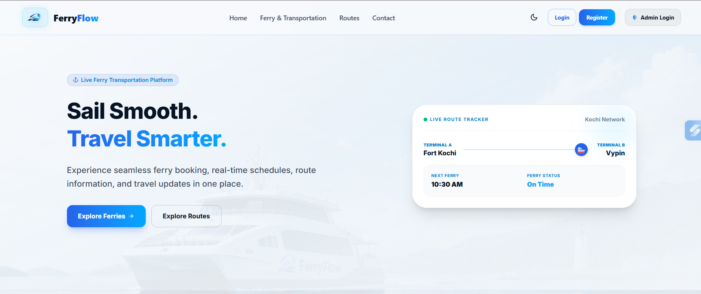
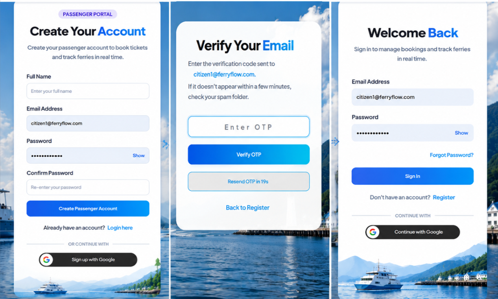
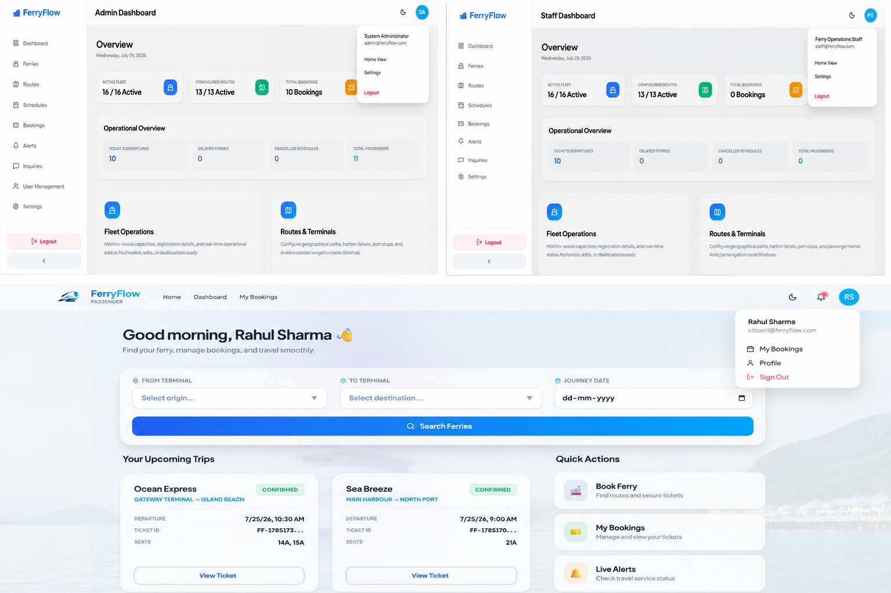
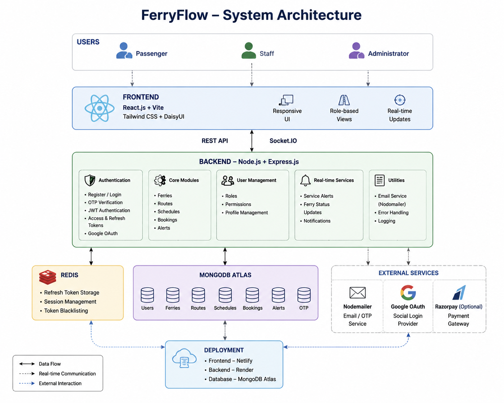
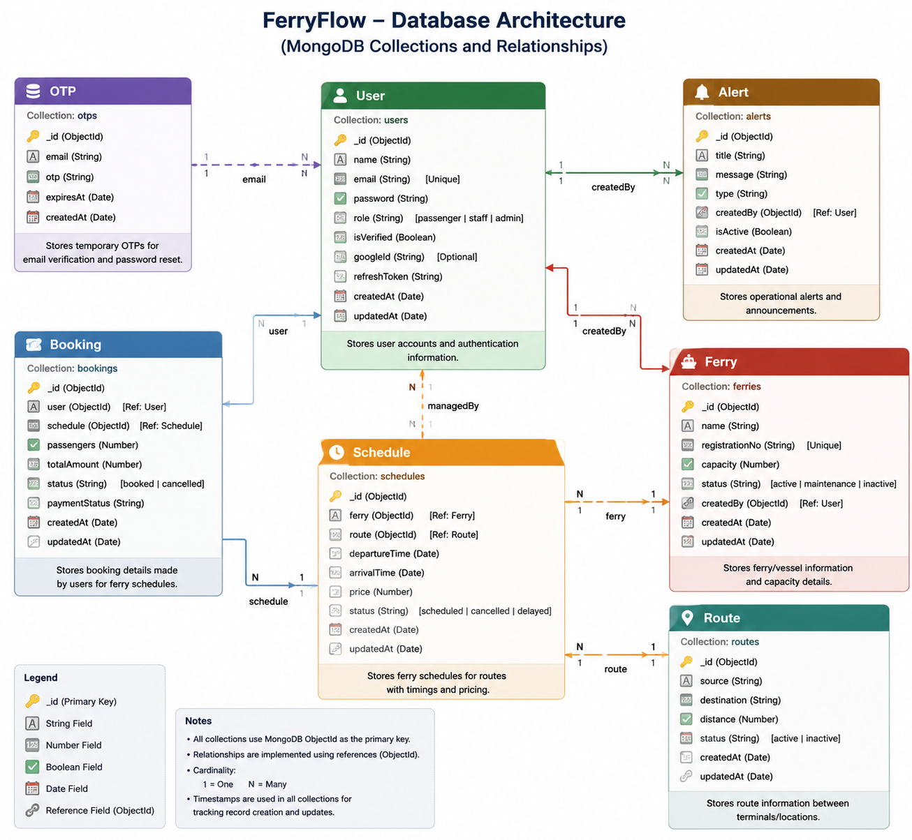
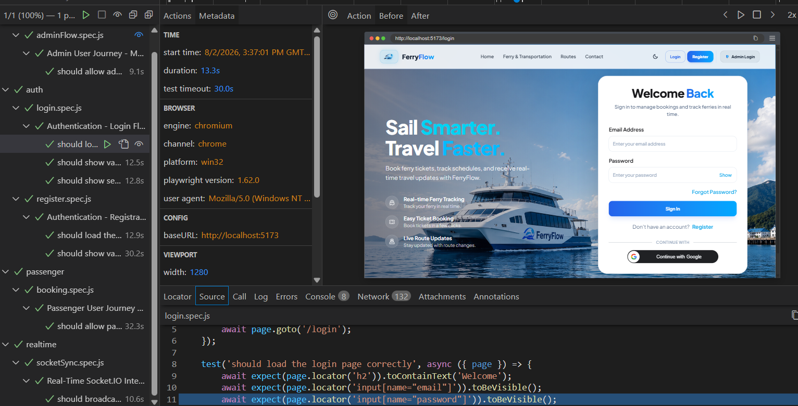

<div align="center">
  

# FerryFlow
### Scalable Real-Time Ferry Operations & Passenger Management System

<p align="center">
  <strong>An optimized maritime transportation ecosystem engineered for real-time fleet operations, secure seat bookings, and role-based passenger management.</strong>
</p>

</div>

---

## 📑 Table of Contents
- [Project Links](#-project-links)
- [Features](#-features)
- [Authentication & Security](#-authentication--security)
- [Demo Credentials](#-demo-credentials)
- [Screenshots](#-screenshots)
- [System Architecture](#️-system-architecture)
- [Folder Structure](#-folder-structure)
- [API Highlights](#-api-highlights)
- [Tech Stack](#️-tech-stack)
- [Testing](#-testing)
- [Installation Setup](#-installation-setup)
- [Environment Variables](#️-environment-variables)
- [Deployment](#-deployment)
- [Key Design Decisions](#-key-design-decisions)
- [Future Enhancements](#-future-enhancements)
- [Acknowledgments](#-acknowledgments)
- [Author](#-author)
- [License](#-license)

---

## 🔗 Project Links

- **Live Website**: [https://ferryflow.netlify.app/](https://ferryflow.netlify.app/)
- **GitHub Repository**: [https://github.com/nitin-code6/ferryflow](https://github.com/nitin-code6/ferryflow)
- **Detailed Project Report**: [https://github.com/nitin-code6/ferryflow/tree/main/docs](https://github.com/nitin-code6/ferryflow/tree/main/docs)
- **Project Demo Video**: [https://youtu.be/MVJt-MybjTQ](https://youtu.be/MVJt-MybjTQ)

---

## ✨ Features

- **Multi-Role Access System**: Distinct interfaces and permissions for Admin, Staff, and Passengers.
- **Real-Time Booking Engine**: Server-side seat overlap prevention with interactive seat selection.
- **Automated Schedule Orchestration**: Dynamic departure/arrival timelines pairing vessels to physical transit routes.
- **WebSocket Alerts**: Global broadcasts and schedule updates pushed instantly to all connected clients.
- **Secure Payments**: Integrated Razorpay gateway with backend signature verification.

---

## 🔐 Authentication & Security

- **Dual JWT Token Architecture**: Utilizes short-lived access tokens and long-lived Redis-backed refresh tokens stored securely via `HttpOnly` cookies.
- **OAuth Integration**: One-click Google Sign-In via `google-auth-library`.
- **OTP Verification Flow**: Email verification using OTPs powered by Nodemailer.
- **Strict Rate Limiting**: Redis-backed limiters (`express-rate-limit`) applied to authentication routes to proactively prevent brute-force attacks.
- **Data Validation**: End-to-end request body validation utilizing Zod schemas.

---

## 🔑 Demo Credentials

**Admin:**
- Email: `admin@ferryflow.com`
- Password: `Password@123`

**Staff:**
- Email: `staff1@ferryflow.com`
- Password: `Password@123`

**Passenger:**
- Email: `passenger1@ferryflow.com`
- Password: `Password@123`

---

## 📸 Screenshots

### Landing Page
<p align="center">
  
</p>

### Authentication
<p align="center">
  
</p>

### Dashboard
<p align="center">
  
</p>

---

## 🏗️ System Architecture

FerryFlow is built on a Service-Oriented Architecture decoupling RESTful HTTP endpoints, business logic, MongoDB persistence, and Socket.IO real-time events.

<p align="center">
  
</p>

### Database Schema

<p align="center">
  
</p>


---

## 📁 Folder Structure

```text
FerryFlow/
├── server/
│   ├── src/
│   │   ├── config/                # Environment, Redis & MongoDB configuration logic
│   │   ├── controllers/           # auth.controller, ferry.controller, booking.controller, etc.
│   │   ├── middleware/            # auth.middleware, role.middleware, authLimiter, otpLimiter
│   │   ├── models/                # User, Booking, Ferry, Route, Schedule, Alert, Otp schemas
│   │   ├── routes/                # auth.routes, ferry.routes, booking.route, schedule.route...
│   │   ├── services/              # googleLoginService.js, schedule.service.js
│   │   ├── validators/            # Zod validation schemas (auth, booking, ferry, etc.)
│   │   ├── utils/                 # Utilities and helper modules
│   │   ├── constants/             # Constant variable definitions
│   │   ├── app.js                 # Express Application Setup
│   │   └── server.js              # Node.js Server Entry Point
│   ├── tests/                     # Jest setup and execution scripts (e.g. ferry.test.js)
│   ├── seedData.js                # Database seeder (Admin, Staff, Passengers, Ferries, Routes)
│   ├── .env                       # Backend Environment Variables
│   └── package.json               # Server Dependencies (Mongoose, Express, JWT, Razorpay)
├── client/
│   ├── src/
│   │   ├── assets/                # Screenshots, logos, and graphic resources
│   │   ├── components/            # Reusable UI components
│   │   │   ├── ferry/             # Ferry-related visual components
│   │   │   ├── layout/            # Layout wrappers and structural components
│   │   │   ├── navbar/            # Responsive navigation bar
│   │   │   ├── route/             # Route-specific UI components
│   │   │   ├── schedule/          # Schedule viewing and booking components
│   │   │   └── RoleProtectedRoute.jsx  # Role-based route guard
│   │   ├── pages/                 # Full Page Views
│   │   │   ├── admin/             # Admin Dashboard, Ferry/Route/Schedule Management
│   │   │   ├── passenger/         # Passenger Dashboard, Booking, Ticket Views
│   │   │   ├── public/            # Landing Page, Unauthorized access views
│   │   │   └── private/           # Authenticated user scope routes
│   │   ├── services/              # API Integration Wrappers via Axios
│   │   ├── contexts/              # Global React State contexts
│   │   ├── hooks/                 # Custom React Hooks
│   │   ├── App.jsx                # Client React-Router Route Declarations
│   │   └── main.jsx               # React DOM Entrypoint
│   ├── .env                       # Frontend Environment Variables
│   ├── vite.config.js             # Vite Build Settings
│   ├── eslint.config.mjs          # ESLint rules and settings
│   └── package.json               # Frontend Dependencies (React, Vite, Tailwind CSS, DaisyUI)
└── README.md                      # Detailed Project Documentation
```

---

## 📡 API Highlights

| Method | Endpoint | Description | Access |
|---|---|---|---|
| `POST` | `/api/auth/login` | Authenticate & issue session tokens | Public |
| `GET` | `/api/schedules/search`| Search via `source`, `destination`, `date` | Public |
| `POST` | `/api/bookings` | Initialize active seat reservation | User |
| `POST` | `/api/payments/create-order`| Generate Razorpay Order ID payload | User |
| `POST` | `/api/payments/verify` | Verify cryptographic payment signature | User |

---

## 🛠️ Tech Stack

**Frontend:**
- React 19
- Vite
- React Router
- Tailwind CSS & DaisyUI
- Axios
- Socket.IO Client
- React Hook Form & Zod

**Backend:**
- Node.js & Express.js
- MongoDB & Mongoose
- Redis (Session Management & Rate Limiting)
- Socket.IO (WebSockets)
- Razorpay (Payments)
- Nodemailer (Emails)
- JWT & Bcrypt (Authentication)

---

## 🧪 Testing

End-to-End (E2E) testing ensures reliability across critical user flows like booking and authentication.

<p align="center">
  
</p>

---

## 📥 Installation Setup

### Prerequisites
Before you begin, ensure you have the following installed on your local machine:
- **Node.js** (v18.0.0 or higher)
- **MongoDB** (v7.0 or higher, running on port `27017`)
- **Redis** (v6.0 or higher, running on port `6379`)
- **Git**

### Setup Steps

1. **Clone the repository:**
   ```bash
   git clone https://github.com/nitin-code6/ferryflow.git
   cd ferryflow
   ```

2. **Backend Setup:**
   - Ensure MongoDB (port 27017) and Redis (port 6379) are running locally.
   ```bash
   cd server
   npm install
   # Configure your .env file here
   npm run dev
   ```

3. **Frontend Setup:**
   ```bash
   cd client
   npm install
   # Configure your .env file here
   npm run dev
   ```

*(Optional): To populate the database with initial routes, ferries, and users, run `node seedData.js` from the `server` directory.*

---

## ⚙️ Environment Variables

Create a `.env` file in the respective directories with the following configuration:

### Backend (`server/.env`)
```env
PORT=5000
MONGODB_URI=mongodb://127.0.0.1:27017/ferryflow
JWT_SECRET=your_jwt_secret
JWT_REFRESH_SECRET=your_refresh_secret
REDIS_URL=redis://127.0.0.1:6379
GOOGLE_CLIENT_ID=your_google_id.apps.googleusercontent.com
RAZORPAY_KEY_ID=your_razorpay_key
RAZORPAY_KEY_SECRET=your_razorpay_secret
SMTP_USER=your_email@gmail.com
SMTP_PASS=your_app_password
FRONTEND_URL=http://localhost:5173
```

### Frontend (`client/.env`)
```env
VITE_API_URL=http://localhost:5000/api
VITE_SOCKET_URL=http://localhost:5000
VITE_GOOGLE_CLIENT_ID=your_google_id.apps.googleusercontent.com
```

---

## 🚀 Deployment

- **Frontend**: The Vite-based React application is optimized for deployment on platforms like Netlify or Vercel. Set the build command to `npm run build` and output directory to `dist`.
- **Backend**: The Express application can be hosted on platforms like Render, Railway, or AWS EC2 using `npm start`. Ensure environment variables (including MongoDB Atlas and cloud Redis URIs) are securely configured.

---

## 🧠 Key Design Decisions

- **Race Condition Prevention:** The booking engine uses atomic MongoDB queries combined with real-time Socket.IO broadcasts to guarantee that two users cannot successfully reserve the exact same seat simultaneously.
- **Optimized Rate Limiting:** Chosen Redis over a MongoDB-backed rate limiter to completely avoid disk I/O bottlenecks during sudden spikes of authentication attempts.
- **Fail-Safe Webhook Reconciliation:** If a user closes the browser during a Razorpay transaction, the server-side verification endpoint ensures the booking is either permanently secured or cleanly rolled back without data corruption.

---

## 🔮 Future Enhancements

- **Mobile Application**: React Native companion app for seamless on-the-go passenger ticketing.
- **QR Code Boarding**: Automated digital check-ins via ferry terminal QR ticket scanning.
- **Dynamic Pricing**: Algorithmic price adjustments based on seasonal demand metrics or proximity to vessel departure.

---

## 🙌 Acknowledgments
- UI components built with [DaisyUI](https://daisyui.com/) and [Tailwind CSS](https://tailwindcss.com/).
- Payment gateway integrated via [Razorpay](https://razorpay.com/).

---

## 👨‍💻 Author

**Nitin Kumar**

[GitHub](https://github.com/nitin-code6) 

---

## 📄 License

This project is licensed under the **ISC License**.